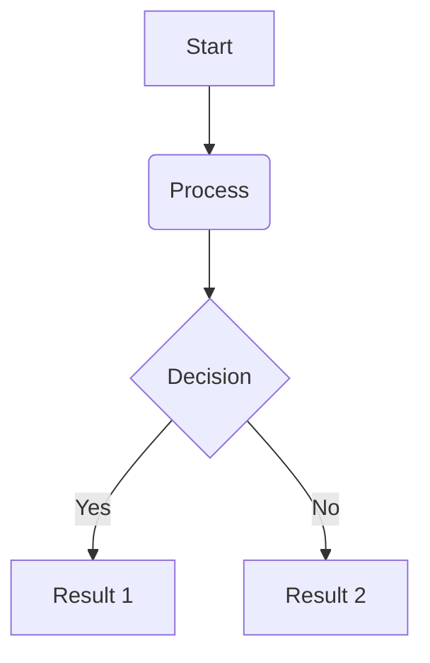

Here is how you can create a Mermaid diagram, a table, and a list in a Markdown (`.md`) file.

## 1. Mermaid Diagram

Mermaid allows you to create diagrams using text. You wrap the syntax inside a standard Markdown code block tagged with `mermaid`.

---

## 2. Table

Tables use vertical bars (`|`) to separate columns and hyphens (`-`) to create the header row.

| Feature | Description | Status |
| --- | --- | --- |
| Lists | Bulleted or numbered | Supported |
| Tables | Grid-based data | Supported |
| Diagrams | Rendered via Mermaid | Supported |

*(Note: The colons `:` in the divider row control text alignment: left, right, or center).*

---

## 3. Lists

Markdown supports both unordered (bulleted) and ordered (numbered) lists.

### Unordered List

* Item 1
* Item 2
* Sub-item 2a
* Sub-item 2b

### Ordered List

1. First step
2. Second step
3. Third step